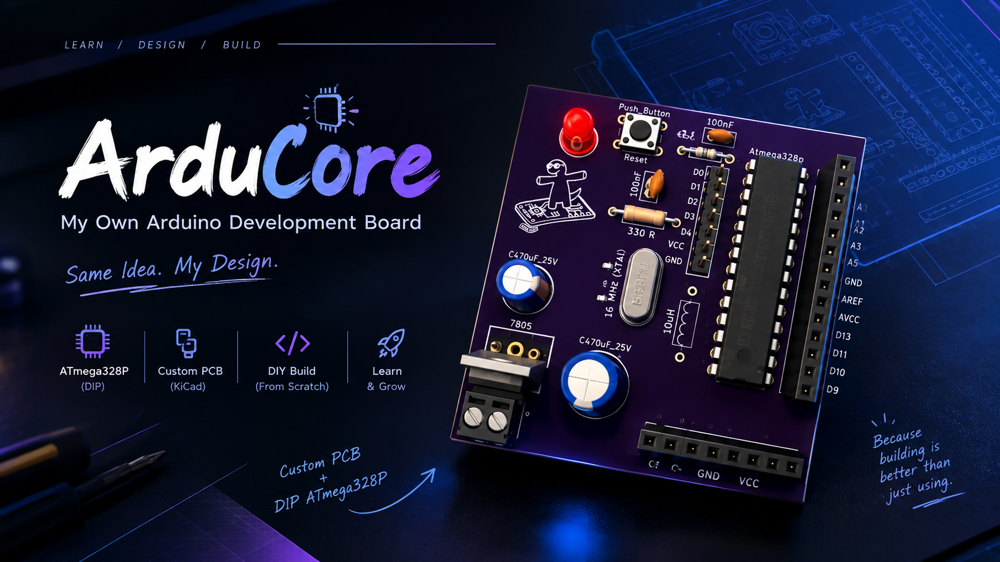
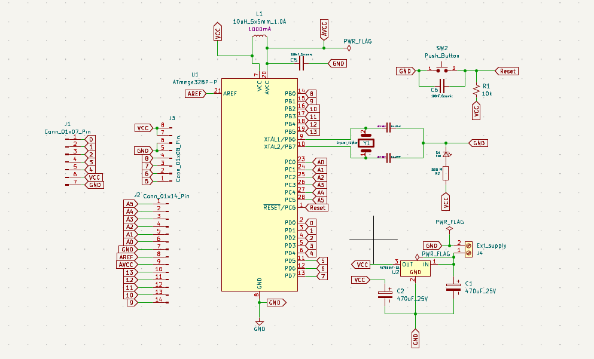
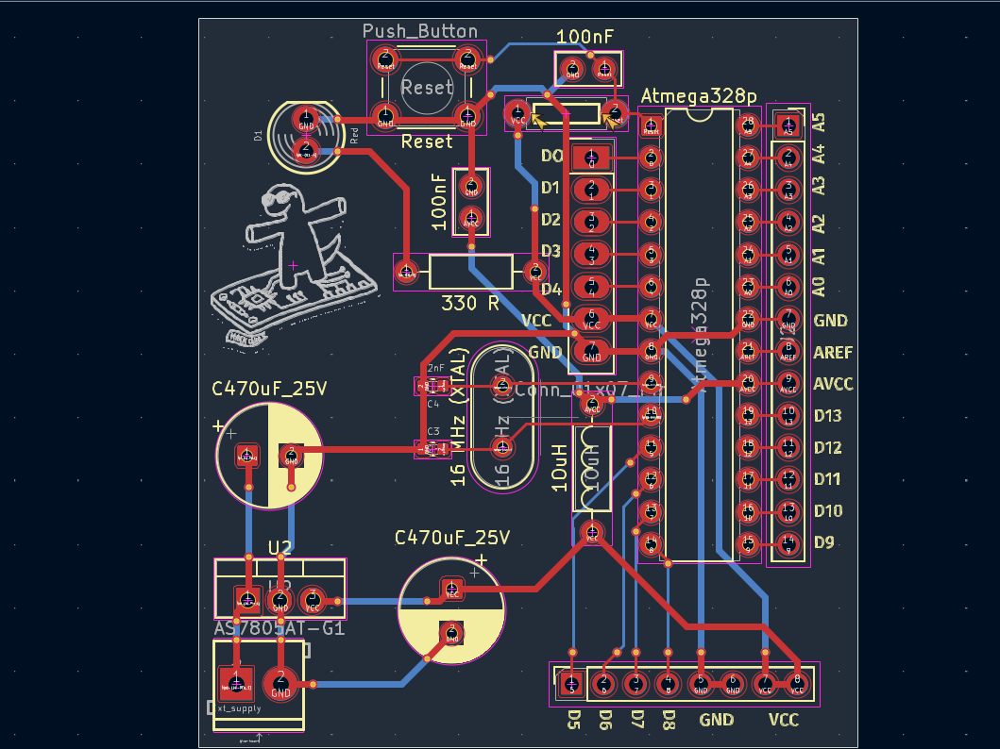
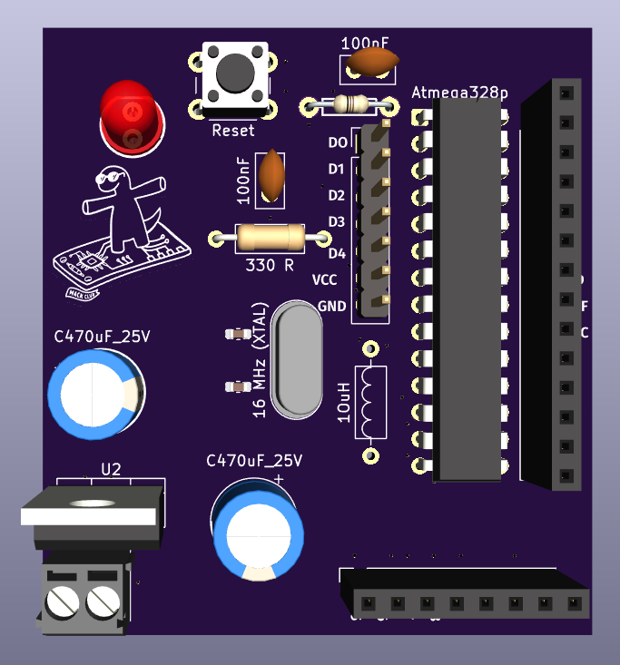

<div align="center">

# ⚡ ArduCore

### My Own Arduino Development Board


<br><br>


<br><br>



<br><br>

**Same idea. My design.**

<br>

[📐 Design](#-design-gallery) •
[⚡ Features](#-features) •
[🧠 How It Works](#-how-it-works) •
[🔌 Programming](#-programming) •
[🏭 Manufacturing](#-manufacturing) •
[🚀 Roadmap](#-roadmap)

</div>

---

## 🔥 Why ArduCore?

Most of the time, an Arduino is something you plug in and start coding.

I wanted to go one step deeper.

Instead of using a ready-made Arduino board, I designed the **microcontroller circuit, power section, reset circuit, clock circuit, headers, and PCB layout myself**.

The goal wasn't just to make another Arduino.

The goal was to understand **why every component exists and how everything works together.**

---

# ⚡ Features

| Feature | Details |
|---|---|
| 🧠 Microcontroller | **ATmega328P-PU** |
| 📦 Package | **DIP-28** |
| ⏱️ Clock | **16 MHz crystal oscillator** |
| 🔋 Power Regulation | **7805 linear regulator** |
| 🔄 Reset | Dedicated push button |
| 💡 Indicators | Power / status LEDs |
| 🔌 I/O | Digital I/O headers |
| ⚡ Power | External power input |
| 🛠️ PCB | Custom 2-layer PCB |
| 📐 Design Tool | KiCad |
| 🔥 Programming | Arduino ISP |
| 💻 USB Programmer | **Not built into the board** |

---

# 🧠 How It Works

At the heart of ArduCore is the **ATmega328P**.

The supporting circuitry provides everything the microcontroller needs to operate:

```text
                    ┌───────────────────────┐
                    │       ArduCore        │
                    │                       │
                    │    ATmega328P-PU      │
                    │                       │
                    └───────────┬───────────┘
                                │
             ┌──────────────────┼──────────────────┐
             │                  │                  │
             ▼                  ▼                  ▼
        ┌─────────┐       ┌──────────┐       ┌─────────┐
        │  Clock  │       │  Reset   │       │  Power  │
        │ 16 MHz  │       │ Circuit  │       │  7805   │
        └─────────┘       └──────────┘       └────┬────┘
                                                   │
                                                   ▼
                                             ┌──────────┐
                                             │  +5 V    │
                                             └──────────┘
                                                   │
                                                   ▼
                                            ATmega328P
                                                   │
                            ┌──────────────────────┼───────────────────┐
                            ▼                      ▼                   ▼
                       Digital I/O             LEDs              Headers
```

---

# 🔬 Hardware Design

## 🧠 Microcontroller

The main controller is:

**ATmega328P-PU — DIP-28**

The DIP package makes the microcontroller easy to remove, replace, and experiment with.

## ⏱️ Clock Circuit

ArduCore uses a:

**16 MHz crystal oscillator**

This provides the clock source required for the ATmega328P to operate in the Arduino-style configuration.

## 🔄 Reset Circuit

A dedicated push button provides manual reset functionality.

Pressing the button resets the ATmega328P and allows the board to restart.

## ⚡ Power Section

The board uses a:

**7805 linear voltage regulator**

The power section also includes bulk and decoupling capacitors to help stabilize the supply.

## 🔌 I/O Headers

The ATmega328P's available I/O pins are brought out to headers so the board can be used with external electronics projects.

---

# 📐 Design Gallery

<div align="center">

### 🧩 Schematic



<br><br>

### 🟦 PCB Layout



<br><br>

### 🧊 3D PCB View



</div>

---

# 🧩 Block Diagram

```text
       External Power
             │
             ▼
      ┌──────────────┐
      │     7805     │
      │   Regulator  │
      └──────┬───────┘
             │ +5V
             ▼
      ┌──────────────┐
      │  ATmega328P  │
      │              │
      │    DIP-28    │
      └──────┬───────┘
             │
      ┌──────┼───────────────┐
      │      │               │
      ▼      ▼               ▼
   GPIO    Crystal          Reset
 Headers    16MHz           Button
      │
      ▼
 External
  Modules
```

---

# 🔌 Programming

## Arduino ISP

ArduCore does **not** contain a dedicated USB-to-Serial programmer.

Instead, another Arduino can be used as an **ISP programmer**.

```text
┌───────────────────────┐
│   Arduino Programmer  │
│                       │
│     ArduinoISP        │
└───────────┬───────────┘
            │
            │ ISP
            │
            ▼
┌───────────────────────┐
│       ArduCore        │
│                       │
│     ATmega328P        │
└───────────────────────┘
```

### Programming Process

1. Upload the `ArduinoISP` example to another Arduino.
2. Connect the programmer Arduino to ArduCore.
3. Connect the ISP signals.
4. Connect VCC and GND.
5. Burn the bootloader if required.
6. Upload the desired firmware.

Detailed instructions:

👉 [`Programming ArduCore with Arduino ISP`](documentation/Arduino-ISP.md)

---

# 📌 ISP Connections

| ArduCore | Programmer Arduino | Function |
|---|---|---|
| VCC | VCC | Power |
| GND | GND | Ground |
| MOSI | MOSI | SPI data |
| MISO | MISO | SPI data |
| SCK | SCK | SPI clock |
| RESET | RESET | ATmega328P reset |

---

# 🎥 Project Demo

A project demo or build video can be linked here once uploaded.

If a short preview GIF is added later, it can be displayed directly in this section.

> 🎬 **Full build/demo video:** *Add project video link here*

---

# 🏭 Manufacturing

Manufacturing files are available in:

```text
production/gerbers/
```

The repository contains:

- `F_Cu`
- `B_Cu`
- `F_Mask`
- `B_Mask`
- `F_Silkscreen`
- `B_Silkscreen`
- `Edge_Cuts`
- PTH drill file
- NPTH drill file
- Gerber job file

### 📦 Gerber Package

👉 [`ArduCore-Gerbers.zip`](production/gerbers/ArduCore-Gerbers.zip)

These files can be used for PCB fabrication.

---

# 📦 Bill of Materials

The complete component list is maintained in:

```text
production/bom/
```

### BOM

👉 [`ArduCore-BOM.csv`](production/bom/ArduCore.csv)

The BOM is generated from the KiCad schematic so component references, values, and footprints remain synchronized with the design.

> **Note:** The BOM file will appear here after the final BOM export.

---

# 📁 Repository Structure

```text
ArduCore/
│
├── assets/
│   ├── ArduCore_Banner.png
│   ├── ArduCore_PCB.png
│   ├── ArduCore_3D_PCB.png
│   └── ArduCore_Schematics.png
│
├── documentation/
│   └── Arduino-ISP.md
│
├── pcb/
│   ├── ArduCore.kicad_pcb
│   ├── ArduCore.kicad_pro
│   └── ArduCore.kicad_sch
│
├── production/
│   ├── bom/
│   │   └── ArduCore-BOM.csv
│   │
│   └── gerbers/
│       ├── ArduCore-Gerbers.zip
│       ├── *.gbr
│       └── *.drl
│
├── LICENSE
├── README.md
└── .gitignore
```

---

# 🛠️ Tools Used

<div align="center">


</div>

---

# 📚 What I Learned

This project taught me much more than just making a PCB.

### Hardware

- ATmega328P architecture
- MCU pin functions
- Crystal oscillator circuits
- Reset circuitry
- Voltage regulation
- Decoupling capacitors
- GPIO routing

### PCB Design

- Schematic capture
- Footprint selection
- PCB placement
- Trace routing
- Ground planes
- Design Rule Checking
- Gerber generation
- Manufacturing preparation

### Embedded

- Arduino ISP
- Bootloader programming
- ATmega328P programming
- Understanding what happens underneath a development board

---

# 🚀 Roadmap

```bash
[x] Research Arduino hardware
[x] Select ATmega328P
[x] Design schematic
[x] Design PCB
[x] Route PCB
[x] 3D PCB review
[x] Generate Gerbers
[ ] Generate final BOM
[ ] Fabricate PCB
[ ] Assemble components
[ ] Program ATmega328P
[ ] Burn bootloader
[ ] Test GPIO
[ ] Test power section
[ ] Test reset circuit
[ ] Test first firmware
[ ] Build Revision 2
```

---

# 🔮 Future Improvements

Possible improvements for a future revision:

- USB-to-Serial interface
- USB-C connector
- Improved power input
- Reverse-polarity protection
- Dedicated ISP header
- Improved power indication
- Additional expansion headers
- Improved silkscreen
- Smaller PCB footprint

---

# 📸 Project Journey

This project started with a simple question:

> **"What's actually inside an Arduino?"**

Then it became:

```text
Research
   ↓
Understand the ATmega328P
   ↓
Draw the schematic
   ↓
Connect the supporting circuitry
   ↓
Design the PCB
   ↓
Route everything
   ↓
Generate manufacturing files
   ↓
Build the hardware
   ↓
Program it
   ↓
Test it
   ↓
Improve it
```

And this is only **Revision 1**.

---

# ⚡ Project Status

<div align="center">

| Stage | Status |
|---|---|
| Research | ✅ Complete |
| Schematic | ✅ Complete |
| PCB Layout | ✅ Complete |
| 3D Review | ✅ Complete |
| Gerbers | ✅ Generated |
| BOM | 🔄 In Progress |
| PCB Fabrication | ⏳ Pending |
| Assembly | ⏳ Pending |
| Programming | ⏳ Pending |
| Hardware Testing | ⏳ Pending |
| Revision 2 | 🔮 Future |

</div>

---

# 💭 Why I Built This

I didn't want to just **use** an Arduino.

I wanted to understand how one actually works.

Building ArduCore meant going from:

**"I know how to program an Arduino."**

to:

**"I understand the hardware that makes an Arduino-style board possible."**

That's the whole point of this project.

---

<div align="center">

# ⚡ ArduCore

### Build it. Break it. Understand it. Improve it.

<br>


</div>
